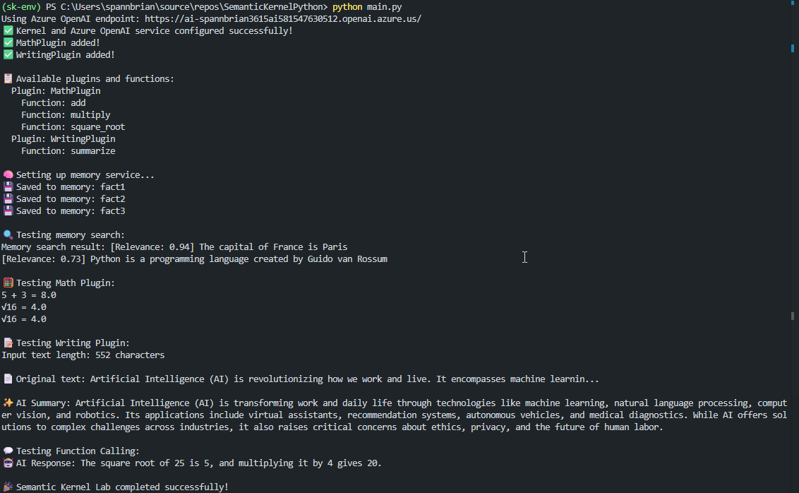

# Semantic Kernel Python Hands-On Lab Guide - Azure Government

This comprehensive lab guide will walk you through building a complete Semantic Kernel application in Python. You'll learn to create kernels, add services, implement plugins, configure memory, and add filters using Azure OpenAI in Azure Government Cloud.

## Prerequisites

### Development Environment
- Visual Studio Code
- Python 3.8 or later (Python 3.10+ recommended)
- Python extension for VS Code

### Required Azure OpenAI Resources
- Azure OpenAI resource deployed in Azure Government Cloud
- Azure OpenAI service endpoint (e.g., `https://your-resource.openai.usgovcloudapi.net/`)
- Azure OpenAI API key
- Deployed models: `gpt-35-turbo` and `text-embedding-ada-002`

## Required Python Packages

Before starting the Python lab, you'll need to install the following Python packages. Each package serves a specific purpose in the Semantic Kernel ecosystem:

| Package Name | Version | Purpose |
|--------------|---------|---------|
| `semantic-kernel[azure]` | 1.27.0+ | Core Semantic Kernel with Azure connectors for Azure OpenAI and other Azure services |
| `python-dotenv` | Latest | Environment variable management for secure configuration |
| `aiofiles` | Latest | Asynchronous file operations (required by some SK components) |

**Package Details:**

- **`semantic-kernel[azure]`:** Includes the core Semantic Kernel library plus Azure-specific connectors (Azure OpenAI, Azure AI Inference, etc.). The `[azure]` extra automatically includes all necessary Azure dependencies.
- **`python-dotenv`:** Enables loading configuration from `.env` files for secure credential management
- **`aiofiles`:** Supports asynchronous file operations used by some Semantic Kernel components

**Important Notes:**
- **Azure Authentication:** Azure OpenAI services support both API key and Microsoft Entra ID authentication. For API key authentication (used in this lab), no additional authentication packages are required.
- **Latest Version:** Semantic Kernel 1.27.0+ includes the latest Azure OpenAI features and Azure Government support.
- **Simplified Dependencies:** The `semantic-kernel[azure]` package now includes all necessary Azure service dependencies, eliminating the need for separate `azure-identity` and `numpy` packages for basic functionality.

## Step 1: Python Project Setup

1. **Create a new folder** for the Python project:
   ```bash
   mkdir SemanticKernelPython
   cd SemanticKernelPython
   code .
   ```

2. **Create a virtual environment** in the VS Code terminal:
   ```bash
   python -m venv sk-env
   # On Windows:
   sk-env\Scripts\activate
   # On macOS/Linux:
   source sk-env/bin/activate
   ```

3. **Install required packages** using the installation command from the Required Python Packages section above:
   ```bash
   pip install semantic-kernel[azure] python-dotenv aiofiles
   ```

   > **What you're doing:** The `[azure]` extra ensures you get all Azure-specific connectors needed for Azure Government integration, including all necessary Azure service dependencies. The other packages provide configuration management and supporting functionality.

4. **Create a `requirements.txt` file** to track dependencies:
   ```bash
   pip freeze > requirements.txt
   ```

## Step 2: Create Main Application File

5. **Create `main.py`** with the basic kernel setup:

```python
import asyncio
import os
from semantic_kernel import Kernel
from semantic_kernel.connectors.ai.open_ai import AzureChatCompletion
from semantic_kernel.contents import ChatHistory
from semantic_kernel.connectors.ai.open_ai.prompt_execution_settings.azure_chat_prompt_execution_settings import AzureChatPromptExecutionSettings
from semantic_kernel.functions import KernelArguments
from semantic_kernel.connectors.ai.function_choice_behavior import FunctionChoiceBehavior
from semantic_kernel.functions.kernel_function_decorator import kernel_function

from dotenv import load_dotenv

# Load environment variables
load_dotenv()

async def main():
    try:
        # Create kernel
        kernel = Kernel()
        
        # Get Azure OpenAI details from environment variables for security
        endpoint = os.getenv("AZURE_OPENAI_ENDPOINT")
        api_key = os.getenv("AZURE_OPENAI_API_KEY")
        deployment_name = os.getenv("AZURE_OPENAI_DEPLOYMENT_NAME", "gpt-4o")
        
        if not all([endpoint, api_key, deployment_name]):
            raise ValueError("Please set AZURE_OPENAI_ENDPOINT, AZURE_OPENAI_API_KEY, and AZURE_OPENAI_DEPLOYMENT_NAME in your .env file")
        
        print(f"Using Azure OpenAI endpoint: {endpoint}")
        
        # Add Azure OpenAI chat completion service for Azure Government
        chat_completion = AzureChatCompletion(
            deployment_name=deployment_name,
            endpoint=endpoint,
            api_key=api_key,
            api_version="2024-06-01"  # Use latest stable API version
        )
        
        kernel.add_service(chat_completion)
        
        # Test basic chat completion with proper error handling
        chat_history = ChatHistory()
        chat_history.add_user_message("Hello, what's the capital of France?")
        
        execution_settings = AzureChatPromptExecutionSettings(
            function_choice_behavior=FunctionChoiceBehavior.Auto(),
            max_tokens=500,
            temperature=0.1
        )
        
        response = await chat_completion.get_chat_message_content(
            chat_history=chat_history,
            settings=execution_settings,
            kernel=kernel
        )
        
        print(f"AI Response: {response}")
        
    except Exception as e:
        print(f"❌ Error: {str(e)}")
        raise

if __name__ == "__main__":
    asyncio.run(main())
```

> **What you're doing:** This sets up the Python Semantic Kernel with Azure OpenAI integration specifically for Azure Government. Note the `.usgovcloudapi.net` endpoint and the use of `AzureOpenAIChatCompletion` instead of the regular OpenAI connector.

6. **Create an `.env` file**
	```bash
	AZURE_OPENAI_ENDPOINT=your_endpoint_here
	AZURE_OPENAI_API_KEY=your_api_key_here
	AZURE_OPENAI_DEPLOYMENT_NAME=gpt-4o
	```
   
7. **Test the basic setup**:
   
   ```bash
   python main.py
   ```

## Step 3: Add Native Plugin

8. **Create `plugins/math_plugin.py`**:
   
   ```bash
   mkdir plugins
   ```

```python
from semantic_kernel.functions import kernel_function
from typing import Annotated
import math

class MathPlugin:
    """A plugin that provides mathematical operations."""
    
    @kernel_function(
        name="add",
        description="Adds two numbers together"
    )
    def add(
        self,
        number1: Annotated[float, "The first number"],
        number2: Annotated[float, "The second number"]
    ) -> float:
        """Add two numbers."""
        return number1 + number2
    
    @kernel_function(
        name="multiply", 
        description="Multiplies two numbers together"
    )
    def multiply(
        self,
        number1: Annotated[float, "The first number"],
        number2: Annotated[float, "The second number"] 
    ) -> float:
        """Multiply two numbers."""
        return number1 * number2
    
    @kernel_function(
        name="square_root",
        description="Calculates the square root of a number"
    )
    def square_root(
        self,
        number: Annotated[float, "The number to calculate square root for"]
    ) -> float:
        """Calculate square root of a number."""
        if number < 0:
            raise ValueError("Cannot calculate square root of negative number")
        return math.sqrt(number)
```

> **What you're doing:** Python native plugins use the `@kernel_function` decorator and type annotations to define callable functions for the AI.

## Step 4: Add Prompt-Based Plugin

9. **Create prompt templates folder structure**:
   ```bash
   mkdir -p plugins/writing_plugin/summarize
   ```

10. **Create `plugins/writing_plugin/summarize/skpromp.txt`**:
```text
Summarize the following text in a concise way:
{{$input}}

Summary:
```

11. **Create `plugins/writing_plugin/summarize/config.json`**:
```json
{
  "schema": 1,
  "description": "Summarizes text content",
  "execution_settings": {
    "default": {
      "max_tokens": 256,
      "temperature": 0.2
    }
  },
  "input_variables": [
    {
      "name": "input",
      "description": "Text to summarize",
      "required": true
    }
  ]
}
```

## Step 5: Add Memory Service

12. **Create `memory_service.py`**:

```python
import os
from typing import List, Optional
from semantic_kernel.memory import SemanticTextMemory
from semantic_kernel.connectors.ai.open_ai import AzureTextEmbedding
from semantic_kernel.memory.volatile_memory_store import VolatileMemoryStore

class MemoryService:
    """Service for managing semantic memory operations with Azure OpenAI."""
    
    def __init__(self, endpoint: str, api_key: str, deployment_name: str):
        # Create Azure OpenAI embedding service for Azure Government
        embedding_service = AzureTextEmbedding(
            deployment_name=deployment_name,
            endpoint=endpoint,
            api_key=api_key
        )
        
        # Create memory with volatile store (in-memory storage)
        memory_store = VolatileMemoryStore()
        self.memory = SemanticTextMemory(memory_store, embedding_service)
        self.collection_name = "general_knowledge"
    
    async def save_information(self, memory_id: str, text: str, description: Optional[str] = None):
        """Save information to memory."""
        await self.memory.save_information(
            collection=self.collection_name,
            text=text,
            id=memory_id,
            description=description or ""
        )
        print(f"💾 Saved to memory: {memory_id}")
    
    async def search_memory(self, query: str, min_relevance_score: float = 0.7, limit: int = 3) -> str:
        """Search memory for relevant information."""
        results = await self.memory.search(
            collection=self.collection_name,
            query=query,
            limit=limit,
            min_relevance_score=min_relevance_score
        )
        
        if not results:
            return "No relevant information found in memory."
        
        formatted_results = []
        for result in results:
            formatted_results.append(f"[Relevance: {result.relevance:.2f}] {result.text}")
        
        return "\n".join(formatted_results)
```

> **What you're doing:** This creates a memory service using Azure OpenAI embeddings specifically configured for Azure Government. It uses the same endpoint pattern and deployment names as your chat completion service.

## Step 6: Add Filters

13. **Create `filters.py`**:

```python
import time
from typing import Any, Callable, Dict
from semantic_kernel.functions import KernelFunction
from semantic_kernel.functions.kernel_arguments import KernelArguments

class LoggingFilter:
    """Filter that logs function invocation details."""
    
    def __init__(self):
        self.blocked_words = {"password", "secret", "apikey", "token"}
    
    async def on_function_invocation(
        self,
        function: KernelFunction,
        arguments: KernelArguments,
        next_filter: Callable
    ) -> Any:
        """Log function invocation details."""
        print(f"🔍 Filter: Executing function '{function.name}'")
        
        # Log arguments (safely)
        arg_strings = []
        for key, value in arguments.items():
            # Don't log sensitive values
            if any(blocked in str(value).lower() for blocked in self.blocked_words):
                arg_strings.append(f"{key}=<REDACTED>")
            else:
                arg_strings.append(f"{key}={value}")
        
        print(f"📥 Input: {', '.join(arg_strings)}")
        
        start_time = time.time()
        
        try:
            result = await next_filter()
            duration = (time.time() - start_time) * 1000
            print(f"✅ Filter: Function '{function.name}' completed in {duration:.1f}ms")
            print(f"📤 Output: {result}")
            return result
        except Exception as ex:
            duration = (time.time() - start_time) * 1000
            print(f"❌ Filter: Function '{function.name}' failed after {duration:.1f}ms: {ex}")
            raise

class SecurityFilter:
    """Filter that blocks potentially sensitive input."""
    
    def __init__(self):
        self.blocked_words = {"password", "secret", "apikey", "token"}
    
    async def on_function_invocation(
        self,
        function: KernelFunction,
        arguments: KernelArguments,
        next_filter: Callable
    ) -> Any:
        """Check for sensitive information in arguments."""
        
        for key, value in arguments.items():
            if value and any(blocked in str(value).lower() for blocked in self.blocked_words):
                print(f"🛡️ Security Filter: Blocked potentially sensitive input in argument '{key}'")
                raise PermissionError(f"Argument '{key}' contains potentially sensitive information")
        
        return await next_filter()
```

> **What you're doing:** These filters provide logging and security functionality, intercepting function calls to monitor and protect against sensitive data exposure.

## Step 7: Environment Configuration

14. **Create `.env` file** for secure credential storage if you have not done so already:

```bash
# Create .env file in the project root with Azure Government specific values
echo "AZURE_OPENAI_ENDPOINT=https://your-resource.openai.usgovcloudapi.net/" > .env
echo "AZURE_OPENAI_API_KEY=your-azure-openai-api-key" >> .env
echo "AZURE_OPENAI_CHAT_DEPLOYMENT=gpt-35-turbo" >> .env
echo "AZURE_OPENAI_EMBEDDING_DEPLOYMENT=text-embedding-ada-002" >> .env
```

15. **Create `.env.example` file** as a template:

```bash
# Example environment variables for Azure Government
AZURE_OPENAI_ENDPOINT=https://your-resource.openai.usgovcloudapi.net/
AZURE_OPENAI_API_KEY=your-azure-openai-api-key-here
AZURE_OPENAI_CHAT_DEPLOYMENT=gpt-35-turbo
AZURE_OPENAI_EMBEDDING_DEPLOYMENT=text-embedding-ada-002
```

16. **Install python-dotenv** (if not already installed from the Required Python Packages section):

```bash
pip install python-dotenv
```

## Step 8: Complete Python Application

17. **Update `main.py`** with the complete implementation:

```python
import asyncio
import os
from semantic_kernel import Kernel
from semantic_kernel.connectors.ai.open_ai import AzureChatCompletion
from semantic_kernel.contents import ChatHistory
from semantic_kernel.connectors.ai.open_ai.prompt_execution_settings.azure_chat_prompt_execution_settings import AzureChatPromptExecutionSettings
from semantic_kernel.functions import KernelArguments
from semantic_kernel.connectors.ai.function_choice_behavior import FunctionChoiceBehavior
from semantic_kernel.functions.kernel_function_decorator import kernel_function

# Import our custom modules
from plugins.math_plugin import MathPlugin
from memory_service import MemoryService

from pathlib import Path
from dotenv import load_dotenv

# Load environment variables
load_dotenv()

async def main():
    try:
        # Create kernel
        kernel = Kernel()
        
        # Get Azure OpenAI details from environment variables
        endpoint = os.getenv("AZURE_OPENAI_ENDPOINT")
        api_key = os.getenv("AZURE_OPENAI_API_KEY")
        deployment_name = os.getenv("AZURE_OPENAI_DEPLOYMENT_NAME", "gpt-4o")
        embedding_deployment = os.getenv("AZURE_OPENAI_EMBEDDING_DEPLOYMENT")
        
        if not all([endpoint, api_key, deployment_name]):
            raise ValueError("Please set AZURE_OPENAI_ENDPOINT, AZURE_OPENAI_API_KEY, and AZURE_OPENAI_DEPLOYMENT_NAME in your .env file")
        
        print(f"Using Azure OpenAI endpoint: {endpoint}")
        
        # Add Azure OpenAI chat completion service
        chat_completion = AzureChatCompletion(
            deployment_name=deployment_name,
            endpoint=endpoint,
            api_key=api_key,
            api_version="2024-06-01"
        )
        
        kernel.add_service(chat_completion)
        print("✅ Kernel and Azure OpenAI service configured successfully!")

        # Add native math plugin
        math_plugin = MathPlugin()
        kernel.add_plugin(math_plugin, plugin_name="MathPlugin")
        print("✅ MathPlugin added!")

        # Add WritingPlugin
        #writing_plugin = WritingPlugin(chat_completion)
        writing = kernel.add_plugin(
            parent_directory=str(Path(__file__).parent / "plugins"), 
            plugin_name="writing_plugin"
        )
        print("✅ WritingPlugin added!")

        # Debug: Show available plugins and functions
        print("\n📋 Available plugins and functions:")
        for plugin_name, plugin in kernel.plugins.items():
            print(f"  Plugin: {plugin_name}")
            for func_name in plugin.functions.keys():
                print(f"    Function: {func_name}")
    
        # Initialize memory service (if embedding deployment is configured)
        if embedding_deployment:
            print("\n🧠 Setting up memory service...")
            memory_service = MemoryService(endpoint, api_key, embedding_deployment)

            # Save some facts to memory
            await memory_service.save_information("fact1", "The capital of France is Paris")
            await memory_service.save_information("fact2", "Python is a programming language created by Guido van Rossum") 
            await memory_service.save_information("fact3", "The Semantic Kernel is a Microsoft framework for AI orchestration")
            
            # Test memory search
            print("\n🔍 Testing memory search:")
            memory_result = await memory_service.search_memory("What is the capital of France?")
            print(f"Memory search result: {memory_result}")
        else:
            print("\n⚠️ Embedding deployment not configured, skipping memory tests")
        
        # Test math plugin
        print("\n🧮 Testing Math Plugin:")
        try:
            math_plugin_ref = kernel.plugins["MathPlugin"]
            add_function = math_plugin_ref.functions["add"]
            
            math_result = await kernel.invoke(
                add_function,
                arguments=KernelArguments(number1=5, number2=3)
            )
            print(f"5 + 3 = {math_result}")

            sqrt_function = math_plugin_ref.functions["square_root"]
            sqrt_result = await kernel.invoke(
                sqrt_function,
                arguments=KernelArguments(number=16)
            )
            print(f"√16 = {sqrt_result}")

        except Exception as e:
            print(f"❌ Math plugin error: {e}")
        
        # Test WritingPlugin
        print("\n📝 Testing Writing Plugin:")
        try:
            sample_text = """
            Artificial Intelligence (AI) is revolutionizing how we work and live. It encompasses machine learning, 
            natural language processing, computer vision, and robotics. AI applications range from virtual assistants 
            and recommendation systems to autonomous vehicles and medical diagnosis tools. As AI technology continues 
            to advance, it promises to solve complex problems across industries while also raising important questions 
            about ethics, privacy, and the future of human work.
            """
            
            print(f"Input text length: {len(sample_text)} characters")
            
            summary_result = await kernel.invoke(
                writing["summarize"],
                KernelArguments(input=sample_text.strip())
            )
            print(f"\n📄 Original text: {sample_text.strip()[:100]}...")
            print(f"\n✨ AI Summary: {summary_result}")
            
        except Exception as e:
            print(f"❌ WritingPlugin error: {e}")
        
        # Test function calling
        print("\n💬 Testing Function Calling:")
        try:
            chat_history = ChatHistory()
            chat_history.add_user_message("Can you calculate the square root of 25 and then multiply it by 4?")
            
            execution_settings = AzureChatPromptExecutionSettings(
                function_choice_behavior=FunctionChoiceBehavior.Auto(),
                max_tokens=500,
                temperature=0.1
            )
            
            response = await chat_completion.get_chat_message_content(
                chat_history=chat_history,
                settings=execution_settings,
                kernel=kernel
            )
            print(f"🤖 AI Response: {response}")
            
        except Exception as e:
            print(f"❌ Function calling error: {e}")
        
        print("\n🎉 Semantic Kernel Lab completed successfully!")
        
    except Exception as e:
        print(f"❌ Error: {str(e)}")
        raise

if __name__ == "__main__":
    asyncio.run(main())
```

## Running the Python Lab

1. **Navigate to your Python project folder** in VS Code

2. **Activate the virtual environment:**
   ```bash
   # Windows:
   sk-env\Scripts\activate
   # macOS/Linux:
   source sk-env/bin/activate
   ```

3. **Set your Azure OpenAI credentials in the `.env` file:**
   ```
   AZURE_OPENAI_ENDPOINT=https://your-actual-resource.openai.usgovcloudapi.net/
   AZURE_OPENAI_API_KEY=your-actual-api-key
   AZURE_OPENAI_CHAT_DEPLOYMENT=gpt-35-turbo
   AZURE_OPENAI_EMBEDDING_DEPLOYMENT=text-embedding-ada-002
   ```

4. **Run the application:**
   ```bash
   python main.py
   ```

5. **Expected output:** Successful demonstrations of all components using Azure Government services. Below is an expected outcome within VS Code terminal running Python.

   

## Key Learning Points

### What You've Built

**Kernel Creation:**
- The kernel is the central orchestration engine that manages AI services, plugins, and execution
- Configured specifically for Azure Government Cloud compliance requirements

**Chat Completion Service:**
- Integrated Azure OpenAI's GPT models deployed in Azure Government for natural language processing
- Configured for function calling to enable AI to use your plugins automatically
- Uses Azure Government specific endpoints (`.usgovcloudapi.net`) for compliance requirements

**Plugin Types:**
- **Native Plugins:** Code-based functions (Python functions) that AI can call
- **Prompt-based Plugins:** Template-driven AI behaviors using structured prompts

**Memory Storage:**
- Semantic search using Azure OpenAI vector embeddings deployed in Azure Government
- In-memory storage for this demo (can be configured for persistent storage)
- Enables AI to remember and retrieve relevant context while maintaining government compliance requirements

**Filters:**
- Pre/post-processing of function calls
- Logging, security, performance monitoring
- Extensible pipeline for custom behaviors (simulated in this version)

### Development Workflow in VS Code

**File Organization:**
```
Python Project:
├── main.py (main application with Azure Government config)
├── .env (Azure Government environment variables)
├── .env.example (Azure Government environment variables template)
├── memory_service.py (memory operations with Azure OpenAI embeddings)
├── filters.py (filter implementations)
└── plugins/
    ├── math_plugin.py (native plugin)
    └── writing_plugin/summarize/ (prompt-based plugin)
        ├── skprompt.txt
        ├── config.json
```

**Key VS Code Features Used:**
- Integrated terminal for package management and running applications
- IntelliSense for code completion and error detection
- File explorer for organizing plugin structures
- Extensions for Python development support

### Package Version Compatibility

**Important Notes:**
- **Semantic Kernel Versioning:** Semantic Kernel is rapidly evolving. Use version 1.35.3+ for the latest features and Azure Government support.
- **Azure Package Dependencies:** The `semantic-kernel[azure]` package automatically installs compatible versions of Azure SDKs and required dependencies.
- **Python Version:** Requires Python 3.10 or later for optimal compatibility with the latest Semantic Kernel features.

**Verifying Installation:**
After installing packages, verify they're working correctly:

**Python Verification:**
```bash
pip list | grep semantic-kernel
pip show semantic-kernel
```

### Troubleshooting Tips

**Common Issues:**
1. **Azure OpenAI Credential Errors:** Ensure your Azure OpenAI resource is properly deployed in Azure Government and API key is valid
2. **Endpoint Configuration:** Verify you're using the correct Azure Government endpoint (`.usgovcloudapi.net`)
3. **Model Deployment Names:** Check that your deployment names exactly match those in Azure OpenAI Studio
4. **Package Versions:** Semantic Kernel is rapidly evolving; ensure Azure connector packages are compatible
5. **Path Issues:** Verify plugin directory structures match exactly as shown
6. **Async/Await:** Both implementations use asynchronous patterns; ensure proper async handling
7. **Government Cloud Access:** Ensure your subscription has access to Azure Government and required services are enabled
8. **Virtual Environment:** Ensure you're working within the activated virtual environment

**Azure Government Specific Considerations:**
- **Compliance:** Azure Government provides FedRAMP High and DoD IL2-IL5 compliance
- **Data Residency:** All data processing occurs within US government data centers
- **Network Isolation:** Government cloud services are isolated from commercial Azure
- **Model Availability:** Check Azure Government documentation for available AI models and regions

**Best Practices:**
- Use environment variables for Azure OpenAI credentials (never hardcode secrets)
- Implement proper error handling for AI service calls
- Structure plugins in separate files/modules for maintainability
- Test each component individually before integration
- Use logging to debug function call flows
- Follow Azure Government security and compliance guidelines
- Regularly update Semantic Kernel packages for latest Azure Government compatibility
- Monitor usage and costs through Azure Government portal
- Always work within virtual environments to avoid package conflicts

**Troubleshooting Package Issues:**
- **Python:** If dependency conflicts occur, consider using a fresh virtual environment
- **Version Conflicts:** Check the Semantic Kernel GitHub releases page for compatible package versions

**Additional Azure Government Resources:**
- [Azure Government Documentation](https://docs.microsoft.com/en-us/azure/azure-government/)
- [Azure OpenAI in Government](https://docs.microsoft.com/en-us/azure/cognitive-services/openai/overview#azure-government)
- [Government Cloud Compliance](https://azure.microsoft.com/en-us/global-infrastructure/government/)

This lab provides a comprehensive foundation for building AI-powered applications with Semantic Kernel using Azure OpenAI in Azure Government, demonstrating core concepts that scale to production scenarios while maintaining government compliance requirements. The Azure Government configuration ensures data sovereignty and regulatory compliance for government and defense applications.